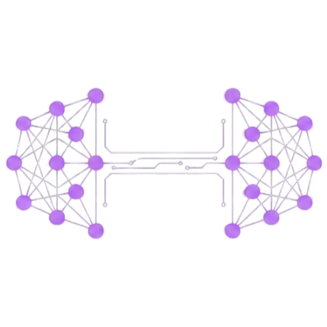

# GymAI - Tu Personal TrAIner

<div align="center">
  
</div>

[](https://fastapi.tiangolo.com/)
[](https://docs.python.org/3/)
[](https://console.groq.com/)
[](https://render.com/)

**GymAI** es una aplicación web inteligente que actúa como tu entrenador personal avanzado. Utilizando la potencia de **Llama 3.3 (70B)** para la generación de rutinas y **Llama 3.2 Vision** para el análisis biomecánico, GymAI crea planes de entrenamiento hiper-personalizados y ofrece retroalimentación técnica en tiempo real.

> [!TIP]
> **Nueva Arquitectura**: El proyecto ha sido refactorizado para soportar alta concurrencia, con una base de código modular, tipado estricto y manejo robusto de errores.

---

## Características Principales

### Inteligencia Artificial Avanzada

- **Generación de Rutinas a Medida**: Algoritmos basados en Llama 3.3 que consideran objetivos, nivel, equipo disponible y lesiones.
- **Coach en Tiempo Real**: Chat interactivo contextual (RAG) que recuerda tu historial y ajusta tu plan sobre la marcha.
- **Visión Computacional**: Sube una foto o video de tu ejercicio y recibe correcciones posturales instantáneas gracias a Llama 3.2 Vision.

### Experiencia de Usuario Fluida

- **Interfaz Reactiva**: Construida con **Bootstrap 5** y **HTMX** para una experiencia SPA sin la complejidad de frameworks pesados.
- **WebSockets**: Comunicación bidireccional para el chat con el entrenador, garantizando respuestas inmediatas.
- **Dashboard Integral**: Visualiza tu progreso, historial de rutinas y métricas clave en un solo lugar.

### Ingeniería Robusta

- **Arquitectura Limpia**: Separación clara de responsabilidades (Servicios, Repositorios, Rutas).
- **Base de Datos Asíncrona**: Soporte nativo para PostgreSQL (Producción) y SQLite (Desarrollo) con SQLAlchemy Async.
- **Listo para Despliegue**: Configuración Docker y Render optimizada.

## Demo

<div align="center">
  <video src="static/demoGymAI.mp4" controls width="100%"></video>
</div>

## Tech Stack

### Backend

- **Framework**: FastAPI (Python 3.11+)
- **ORM**: SQLAlchemy 2.0 (AsyncIO)
- **Validación**: Pydantic V2
- **IA Integration**: Groq SDK (Llama 3.3 & Llama Vision)
- **Server**: Uvicorn / Gunicorn

### Frontend

- **Templating**: Jinja2
- **UI Framework**: Bootstrap 5.3
- **Interactivity**: HTMX 1.9 (AJAX sin escribir JS complejo)
- **Estilos**: CSS3 Moderno (Variables, Flexbox, Grid)

### Infraestructura & Herramientas

- **DB**: PostgreSQL (Prod) / SQLite (Dev)
- **CI/CD**: GitHub Actions
- **Hosting**: Render (Web Service)

---

## Estructura del Proyecto

```text
gym-AI/
├── app/
│   ├── api/            # Endpoints (Routes)
│   ├── core/           # Configuración global y Logging
│   ├── db/             # Conexión y sesión de Base de Datos
│   ├── models/         # Modelos SQLAlchemy (Tablas)
│   ├── repositories/   # Capa de acceso a datos (CRUD)
│   ├── schemas/        # Esquemas Pydantic (Validación)
│   ├── services/       # Lógica de negocio e Integración IA
│   └── websocket/      # Gestión de conexiones en tiempo real
├── docs/               # Documentación y Guías
├── static/             # Assets (CSS, Imágenes)
├── templates/          # Vistas HTML (Jinja2)
├── tests/              # Tests automatizados (Pytest)
├── run.py              # Script de inicio (Dev)
├── render.yaml         # Configuración de despliegue
└── requirements.txt    # Dependencias
```

---

## Instalación y Uso Local

1. **Clonar el repositorio**

   ```bash
   git clone https://github.com/GonzaloPontnau/gym-AI.git
   cd gym-AI
   ```

2. **Configurar el entorno**
   Crea un archivo `.env` en la raíz (puedes copiar el ejemplo si existe o usar estos valores base):

   ```env
   GROQ_API_KEY=tu_api_key_de_groq
   DATABASE_URL=sqlite+aiosqlite:///gym_ai.db
   LOG_LEVEL=INFO
   ```

   > Obtén tu API Key gratis en [Groq Console](https://console.groq.com/).

3. **Instalar dependencias**
   Se recomienda usar un entorno virtual:

   ```bash
   python -m venv venv
   source venv/bin/activate  # En Windows: venv\Scripts\activate
   pip install -r requirements.txt
   ```

4. **Iniciar la aplicación**
   ```bash
   python run.py
   ```
   La aplicación estará disponible en `http://localhost:8000`.

---

## Despliegue en Render

Este proyecto incluye una configuración automática (`render.yaml`).

1. **Crear servicio en Render**:
   - Conecta tu repositorio de GitHub a Render.
   - Selecciona "Blueprints" y apunta a este repositorio.
   - Render detectará el archivo `render.yaml` y configurará el servicio web automáticamente.

2. **Variables de Entorno en Render**:
   Asegúrate de configurar las siguientes variables en el dashboard de Render:
   - `GROQ_API_KEY`: Tu clave privada de Groq.
   - `SECRET_KEY`: Una cadena aleatoria segura para seguridad de sesión.
   - `PYTHON_VERSION`: `3.11.0` (o superior).


## Autor

**Ing. Pontnau, Gonzalo Martín**

💼 [LinkedIn](https://linkedin.com/in/gonzalopontnau)
📧 [Email](mailto:gonzalopontnau@gmail.com)
💻 [Portfolio](https://gonzalopontnau.vercel.app/)
